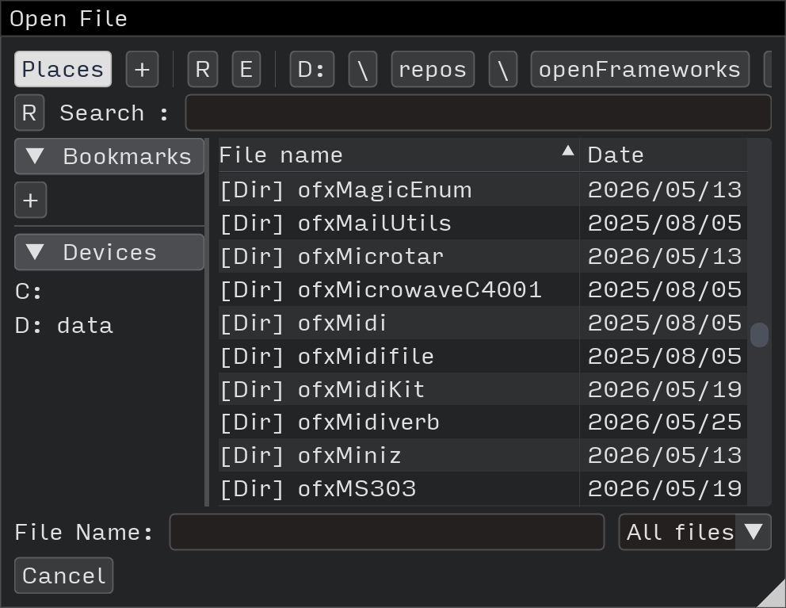

# ofxImGuiFileDialog

openFrameworks addon wrapping [ImGuiFileDialog](https://github.com/aiekick/ImGuiFileDialog) by aiekick.



A full-featured file dialog built entirely on Dear ImGui — no system dependencies, no zenity, no native OS dialogs. Works on Linux, Linux ARM (Raspberry Pi), macOS, and Windows.

## Dependencies

- `ofxImGui`

## Usage

```cpp
#include "ofxImGuiFileDialog.h"

// Inside your ImGui block:

// Open a dialog
if (ImGui::Button("Open File")) {
    IGFD::FileDialogConfig config;
    config.path = ".";
    ImGuiFileDialog::Instance()->OpenDialog("OpenKey", "Choose File", ".png,.jpg,.mp4", config);
}

// Save dialog
if (ImGui::Button("Save File")) {
    IGFD::FileDialogConfig config;
    config.path = ".";
    config.fileName = "output.png";
    ImGuiFileDialog::Instance()->OpenDialog("SaveKey", "Save File", ".png,.jpg", config);
}

// Display (call every frame)
if (ImGuiFileDialog::Instance()->Display("OpenKey")) {
    if (ImGuiFileDialog::Instance()->IsOk()) {
        std::string path = ImGuiFileDialog::Instance()->GetFilePathName();
        // use path
    }
    ImGuiFileDialog::Instance()->Close();
}
```

## License

[ImGuiFileDialog](https://github.com/aiekick/ImGuiFileDialog) is MIT licensed. (Stephane Cuillerdier (aka Aiekick))
